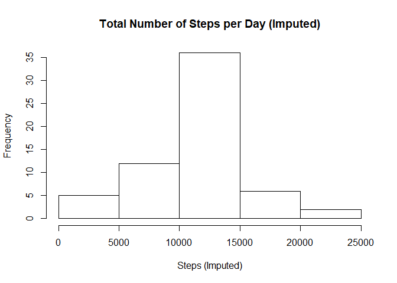

# Reproducible Research: Course Project 1
Chris Kim  
September 24, 2017  


# Loading and preprocessing the data


```r
# load the data
if (!file.exists("data")) {dir.create("data")}
fileUrl = "https://d396qusza40orc.cloudfront.net/repdata%2Fdata%2Factivity.zip"
download.file(fileUrl, destfile = "./data/activity.zip")
file.name <- unzip("./data/activity.zip")
activity <- read.csv(file.name)
dateDownloaded <- date()
```


```r
# remove NA's, keep both 
activity2 <- activity[complete.cases(activity),]

# activity: original data
# activity2: data after removing NA's
```

# What is mean total number of steps taken per day?

```r
# total number of steps taken per day
sum_date <- aggregate(steps~date,activity2,sum)
hist(sum_date$steps,xlab="Steps per Day",ylab="Frequency",main = "Total Number of Steps per Day")
```

<!-- -->

```r
mean(sum_date$steps)
```

```
## [1] 10766.19
```

```r
median(sum_date$steps)
```

```
## [1] 10765
```

# What is the average daily activity pattern?


```r
# average number of steps per 5-minute interval
mean_interval <- aggregate(steps~interval,activity2,mean) 
plot(mean_interval$interval,mean_interval$steps,type='l',
     xlab="Interval",ylab="Average Number of Steps",
     main = "Average Number of Steps per 5-minute Interval")
```

<!-- -->

```r
# which 5-minute interval includes max number of steps?
mean_interval[mean_interval$steps==max(mean_interval$steps),]
```

```
##     interval    steps
## 104      835 206.1698
```
Maximum average number of steps is 206 and the interval is **835**.

# Imputing missing values


```r
# total number of missing values
colSums(is.na(activity))
```

```
##    steps     date interval 
##     2304        0        0
```
Missing values (NA's) happen **2304** times only in steps column.

Devise a strategy for filling in all of the missing values in the dataset: **use the mean for that 5-minute interval**.

```r
# activity3: new data set with imputed strategy
activity3 <- activity
for (i in 1:nrow(activity3)){
    if(is.na(activity3$steps[i])){
        activity3$steps[i] <- mean_interval$steps[mean_interval$interval==activity3$interval[i]]
    }
}

sum_date3 <- aggregate(steps~date,activity3,sum)
hist(sum_date3$steps,xlab="Steps (Imputed)",ylab="Frequency",
     main = "Total Number of Steps per Day (Imputed)")
```

<!-- -->

```r
mean(sum_date3$steps)
```

```
## [1] 10766.19
```

```r
median(sum_date3$steps)
```

```
## [1] 10766.19
```
Mean is the same as before, median is slightly increased. 
Both cases imputing the missing values have very small impact for the Activity dataset.

# Are there differences in activity patterns between weekdays and weekends?


```r
# create new factor variable
for (i in 1:nrow(activity3)){
    tmp <- weekdays(as.Date(activity3$date[i]),abbreviate = TRUE)
    if (tmp=="Sat" | tmp=="Sun") activity3$week[i] <- "weekend"
    else activity3$week[i] <- "weekday"
}

activity3$week <- as.factor(activity3$week)

# plot the panel for weekday/weekend mean steps
library(lattice)
steps_int_week <- aggregate(steps~interval+week,activity3,mean)
xyplot(steps~interval | week, data = steps_int_week,
       layout=c(1,2),type="l",xlab="Interval",ylab="Number of Steps")
```

<!-- -->

